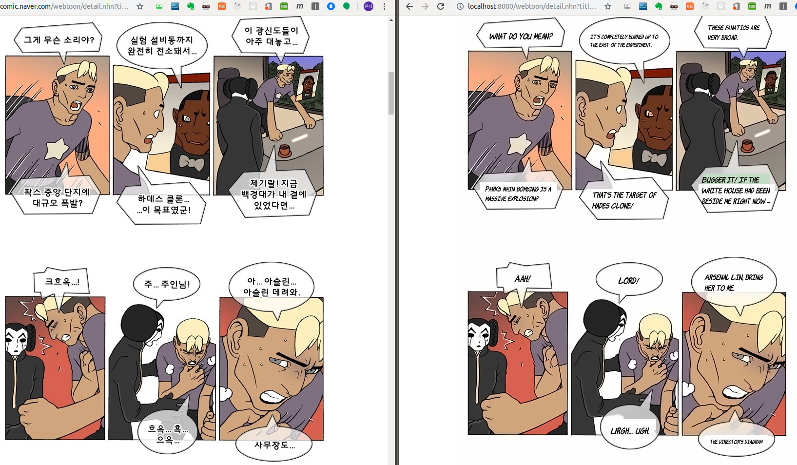
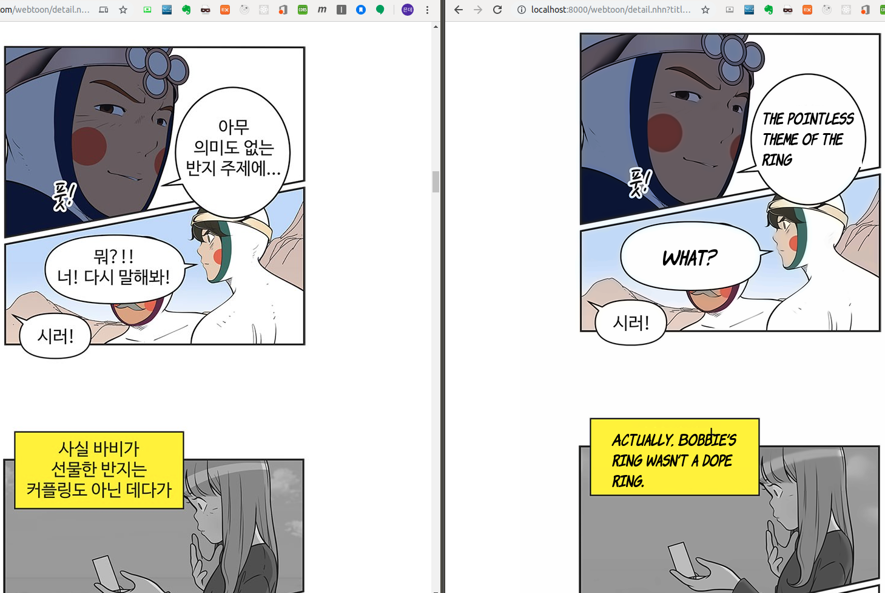
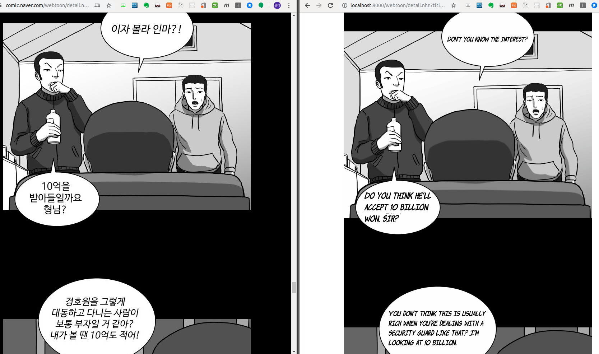

# Webtooniverse : NAVER Webtoon Translator

​	Because of Webtoon's convenience in browser and interesting contents, it gets popular from many global readers. The problem, which occurred by converting difficulties of webtoon, is that different sink of local and global version. To convert webtoon, basically two big pipeline is needed. One is typesetting, which remove text and in-painting that. Another is translating. Both of them takes some times so, process of Korean version is usually faster than other languages. What we implement is NAVER webtoon converting application to solve this problem for global readers.

## Overview






## Requirements

- Following libraries are fundamental to this repository.

> ```
> matplotlib==3.1.1
> numpy==1.16.4
> bs4
> cv2
> PIL
> pytorch == 1.3
> protobuf
> google-cloud-vision
> django == 2.2.7
> ```

- Install [Fairseq](https://github.com/pytorch/fairseq)

  - Install it from source.
  > ```
  > git clone https://github.com/pytorch/fairseq
  > cd fairseq
  > pip install --editable .
  > ```

  - Or, using pip

  > ```
  > pip install fairseq
  > ```

- Need GOOGLE APPLICATION CREDENTIALS

  - Download your Google application credentials from [here](https://console.cloud.google.com/apis/credentials?hl=ko&_ga=2.31092031.-1201035286.1573924448&_gac=1.221223530.1573927628.Cj0KCQiA2b7uBRDsARIsAEE9XpGb0pDs5JK3R2gONj10sxhgMTn8xrD7QNdgd4HATpjQbkQtnABDoPcaAkQJEALw_wcB)
  - Set environment

  > export GOOGLE_APPLICATION_CREDENTIALS="/your/credential/json/file/path"

  - [More details](https://cloud.google.com/docs/authentication/?hl=ko)

- Download Pre-trained transformer model from [here](https://www.dropbox.com/s/cmvkxxk1zr2cmnf/ko-en.zip?dl=0) and place ckpt folder in src/MT folder.

  Thanks to [Kyubyong](https://github.com/Kyubyong/cjk_trans) for pre-trained transformer checkpoint.

## Usage
It takes about 5 minutes depending on lengths of webtoon.

> git clone https://github.com/jaeyoung0909/Cartoon-translator

- Usage from web application 

  > cd demo
  >
  > python manage.py runserver

  Open browser and type 'localhost:8000/' + NAVER webtoon url except 'https://comic.naver.com/' in browser url search window.

  #### Example

  If you want to see https://comic.naver.com/webtoon/detail.nhn?titleId=733033&no=14&weekday=thu,

  Then type "localhost:8000/webtoon/detail.nhn?titleId=733033&no=14&weekday=thu" in your browser url search window.

- Usage from python script 

  > cd src
  >
  > python main.py your_webtoon_url 

  	#### Example 

  > python main.py https://comic.naver.com/webtoon/detail.nhn?titleId=733033&no=14&weekday=thu

  

## References

- Fairseq

  > ```
  > @inproceedings{ott2019fairseq,
  >   title = {fairseq: A Fast, Extensible Toolkit for Sequence Modeling},
  >   author = {Myle Ott and Sergey Edunov and Alexei Baevski and Angela Fan and Sam Gross and Nathan Ng and David Grangier and Michael Auli},
  >   booktitle = {Proceedings of NAACL-HLT 2019: Demonstrations},
  >   year = {2019},
  > }
  > ```

- Pre-trained transformer model from  [Kyubyong](https://github.com/Kyubyong/cjk_trans) 
